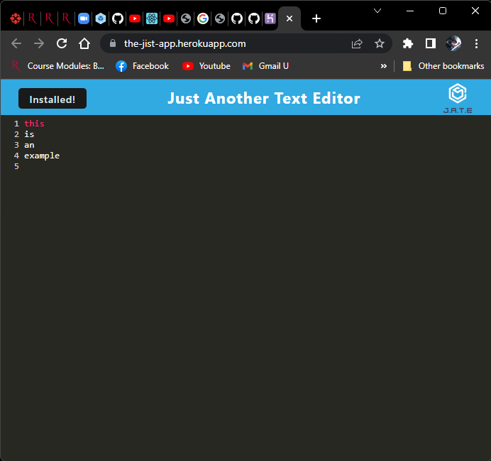

# JIST

## Description
This application is a text editor on the browser that allows the user to save text data using IndexedDB and the app can work offline if the user wants only installing it

## Table of Contents

- [Usage](#usage)
- [Licence](#licence)

## Usage
Install all the packages typing npm install and then you can compile it doing a npm run build, then you can run the server opening the index.html file on live server, you can access the app via heroku too
Then, you can test the api using insomina

## Licence
The Unlicense

## Questions
[Github Profile](https://github.com/braulioloaizac)

Email : bloaizac@uqvirtual.edu.co

[Heroku deployed app](https://the-jist-app.herokuapp.com/)

